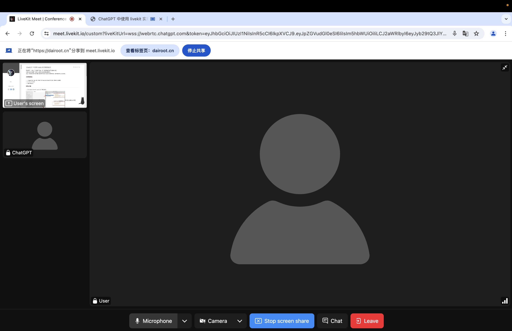

# Using livekit for Video Conferencing in ChatGPT
English / [简体中文](./README_CN.md)

**Current video load is too high**, looking forward to ChatGPT gradually opening up.


### Usage
Modify the `token` value in the file, then execute the command. The output URL will be generated. Open it in your browser.

```bash
python main.py
```


--- 

If you don't have a ChatGPT Token and want to try it out, you can directly visit: https://chatgpt.com and click on `免费体验`


