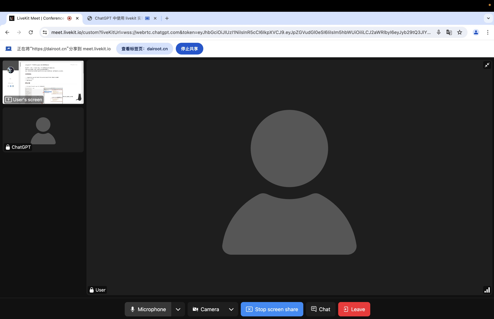
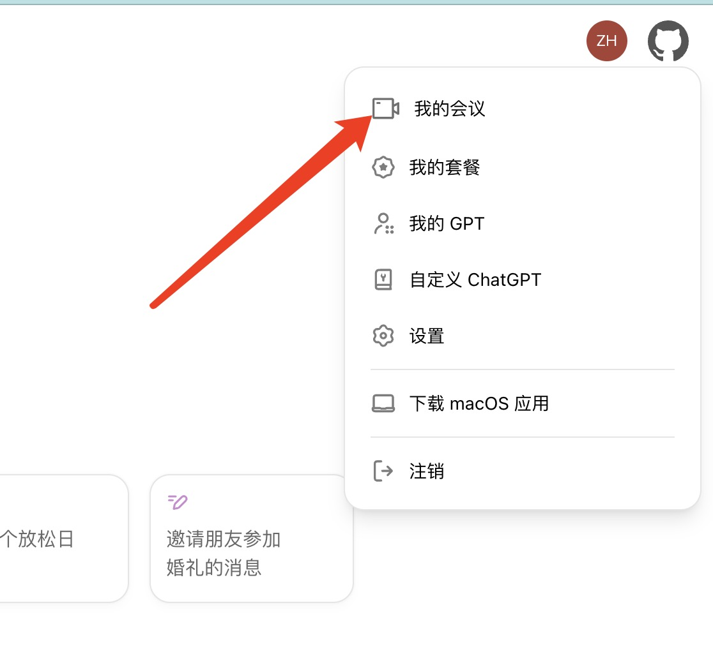

# ChatGPT 中使用 livekit 实现视频会议

**目前视频会出现负载过高**，期待ChatGPT 逐步开放


### 使用方法
修改文件中的 `token` 值后，执行命令，将输出地址，在浏览器打开
```bash
python main.py
```


--- 

若没有ChatGPT Token，又想尝鲜，可以直接访问：https://chatgpt.dairoot.cn 点击`免费体验`



